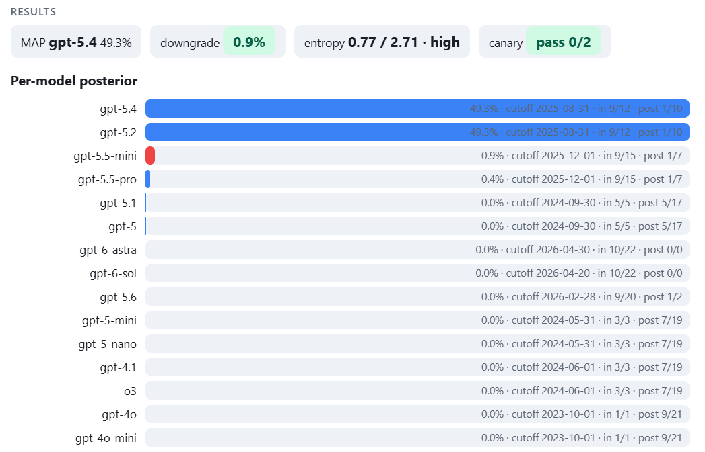

# wimgpt — which model are you talking to?

[中文文档](README.zh-CN.md)

Estimates which model is serving you by probing its training-data cutoff:
quiz the model about dated real events, paste the reply back, get a posterior
over candidate models.

## Use

1. Open `index.html`
2. Copy the quiz, send it in a fresh ChatGPT chat with search disabled.
3. Paste the reply, hit Analyze. (Load sample → Analyze for a demo.)

## How it works

### Setup

A quiz of $n$ dated events $q_1,\dots,q_n$ with event dates $d_1 \le \dots \le d_n$;
candidate models $m_1,\dots,m_M$ with training-data cutoffs $c_1,\dots,c_M$ and
priors $\pi_j = P(m_j)$, $\sum_j \pi_j = 1$ (uniform by default). Each reply
$r_i \in \{0,1\}$: 1 = knows the event.

### Likelihood model

$$P(r_i = 1 \mid m_j) = \begin{cases} p, & d_i \le c_j \\[2pt] \varepsilon, & d_i > c_j \end{cases}$$

with $p = 0.9$ (in-window events can fail recall) and $\varepsilon = 0.05$
(post-cutoff events can be guessed or hallucinated; with $\varepsilon = 0$ a
single hit past a candidate's cutoff would zero its likelihood, and a hit past
every candidate's cutoff would zero all of them).

$$L_j = P(r_{1:n} \mid m_j) = \prod_{i=1}^{n} P(r_i \mid m_j)$$

### Sufficient statistics

$$n_j = \#\{i : d_i \le c_j\}, \qquad K_j = \sum_{d_i \le c_j} r_i, \qquad G_j = \sum_{d_i > c_j} r_i$$

$$L_j = p^{K_j}\,(1-p)^{\,n_j - K_j}\;\cdot\;\varepsilon^{G_j}\,(1-\varepsilon)^{\,n - n_j - G_j}$$

The answer vector enters only through $(n_j, K_j, G_j)$: the test estimates a
change point — where the date-sorted answer sequence flips from 1s to 0s.

### Posterior

$$P(m_j \mid r) = \frac{\pi_j\, L_j}{\sum_{j'=1}^{M} \pi_{j'}\, L_{j'}}, \qquad \log \frac{P(m_a \mid r)}{P(m_b \mid r)} = \log \frac{\pi_a}{\pi_b} + \log \frac{L_a}{L_b}$$

- Uniform priors ⇒ posterior ∝ likelihood.
- Same cutoff ⇒ identical likelihood for every answer pattern; the posterior
  ratio equals the prior ratio (50/50 under uniform priors).

### Evidence per boundary question

A question with $c_a < d_i \le c_b$ contributes to the log-odds between $b$ and $a$:

$$r_i = 1:\ \ \log\frac{p}{\varepsilon} \approx 2.89 \text{ nats} \quad (\approx 18\times)$$

$$r_i = 0:\ \ \log\frac{1-\varepsilon}{1-p} \approx 2.25 \text{ nats toward } a \quad (\approx 9.5\times)$$

Single questions can misfire (10% in-window miss rate), so each gap between
candidate cutoffs carries 2–3 questions.

### Worked example

Two candidates: $A$ (cutoff before $d_2$), $B$ (after). Both questions are in
$B$'s window, only $q_1$ in $A$'s. Reply $r = (1, 0)$:

$$L_A = 0.9 \cdot 0.95 = 0.855 \qquad L_B = 0.9 \cdot 0.10 = 0.09$$

- Uniform prior: $P(A \mid r) = 0.855 / (0.855 + 0.09) = 90.5\%$

### Missing answers

Omitted from the likelihood (scoring them 0 would bias toward older cutoffs).
Fewer than 60% of questions answered invalidates the run.

### Outputs

Per-model posterior; per-cutoff-band posterior; MAP; posterior entropy
$H = -\sum_j P_j \log P_j$; canary check (fabricated events — claiming to know
one flags hallucination). Non-JSON replies are parsed as numbered lines and
graded by keyword match.

## Data files

`questions.json` — dated events (`id`, `date`, `question`, `truth`, `keywords`,
optional `canary`). Place events in the gaps between candidate cutoffs; use
only unguessable specifics — if the answer is guessable from pre-event
knowledge, drop or rephrase the question.

`models.json` — candidates (`id`, `cutoff`); priors default to uniform.
Cutoffs as of 2026-09 (partly third-party; verify against developers.openai.com):

| model | cutoff |
|---|---|
| gpt-6-astra | 2026-04-30 |
| gpt-6-sol | 2026-04-20 |
| gpt-6-luna | 2026-05-18 |
| gpt-5.6 | 2026-02-16 |
| gpt-5.5-pro / 5.5-mini | 2025-12-01 |
| gpt-5.4 / 5.2 | 2025-08-31 |
| gpt-5 / 5.1 | 2024-09-30 |
| gpt-5-mini / nano | 2024-05-31 |
| gpt-4.1 / o3 | 2024-06-01 |
| gpt-4o / 4o-mini | 2023-10-01 |

## Limitations

- Measures the cutoff; same-cutoff candidates are never separated.
- Global $p$/$\varepsilon$: if residual guessability exceeds $\varepsilon=0.05$,
  per-hit Bayes factors are overstated — re-run with $\varepsilon \times 3$ to
  check robustness.
- Web search collapses the test onto the newest cutoff; use a fresh chat with
  search off. Self-report can be suppressed by the web system prompt — verify
  surprising results with free-recall questions.
- One conversation leaks slight context between items; refusals depress $p$.
- Cutoffs change silently.

## Sources

- Cutoffs: [llm-knowledge-cutoff-dates](https://github.com/HaoooWang/llm-knowledge-cutoff-dates),
  [GPT-6 Astra launch](https://openai.com/index/gpt-6-astra/),
  [GPT-5.5 Pro cutoff](https://tutorsbot.com), [GPT-5.6 cutoff](https://www.eesel.ai),
  [GPT-6 Astra cutoff](https://dev.to)
- Event dates: Wikipedia current-events portals
  [2025-10](https://en.wikipedia.org/wiki/Portal:Current_events/October_2025),
  [2026-02](https://en.wikipedia.org/wiki/Portal:Current_events/February_2026),
  [2026-03](https://en.wikipedia.org/wiki/Portal:Current_events/March_2026)
- Downgrade scenario: [community report: 5.6 Pro auto-routed to 5.5 mini](https://community.openai.com)
